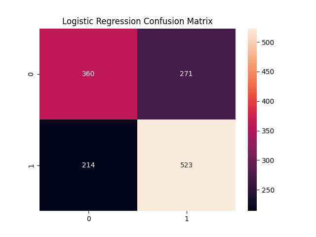
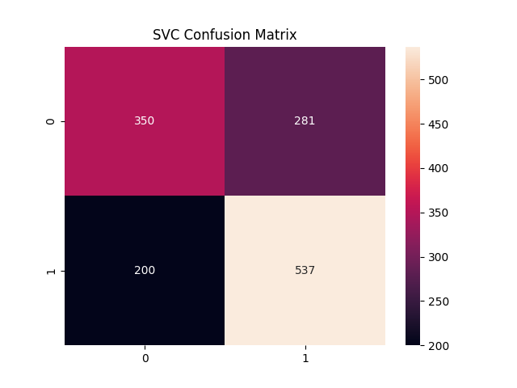
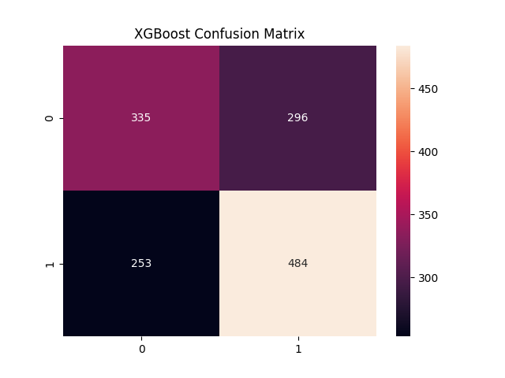

# Football Match Prediction
Predicts whether the home team will win the given match or not  

# Dataset
Premier league match data from the past 22 years. You can download it from this [link](https://www.kaggle.com/datasets/saife245/english-premier-league?select=Datasets)  

Save the folder in your projects main folder

# Data Preparation

Run the file DataPreparation.py to prepare the final data  

Features were engineered from raw data to obtain relevant features
such as cumulative team points for the season, current form, head to head past matches etc.  

# Models

<h3>Logistic Regression</h3>

Model Accuracy: 65%  
Run the file logistic_regression.py to train the model

<h4>Confusion Matrix</h4>

<h3>Random Forest</h3>

Model Accuracy: 63%   

Run the file random_forest.py to train the model

<h4>Confusion Matrix</h4>

<h3>Support Vector Classifier</h3>

Model Accuracy: 65%  
Run the file SVC.py to train the model

<h4>Confusion Matrix</h4>

<h3>XGBoost</h3>

Model Accuracy: 60%
Run the file xgb.py to train the model

<h3>GridSearchCV</h3>

Scoring: F1   
Training: 0.7108  
Test    : 0.7104  
Accuracy: 0.6255

